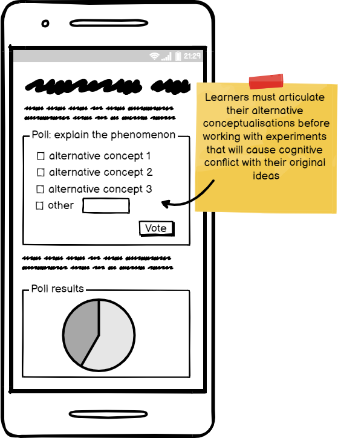

**Cognitive Dissonance**

Learner’s who hold two contradictory conceptualisations experience an intrinsic motivation to learn in order to resolve their physiological stress.

| Learners:     |   
| ------------- | 
|work with about 4 pieces of novel information to reduce intrinsic cognitive load| 
|use worked examples of scaffolded demonstrations of how to solve problems| 
|reduce scaffolding as learners progress from novice to expert| 
|reduce extrinsic load distractions to release more working memory resources|

